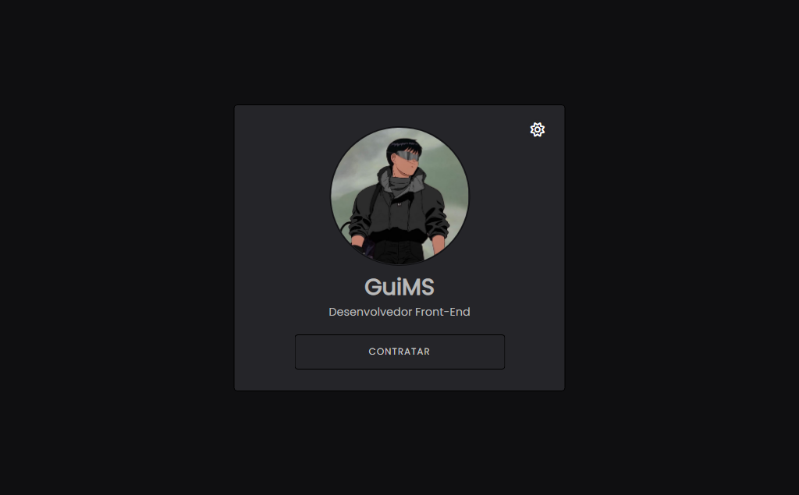

# Dark Mode Page

> Dark Mode

Criei esse projeto modo dark para aprimorar meus conhecimentos em JavaScript.

[Clique para acessar](https://guimiiller.github.io/dark_mode/)

## 🚀 Tecnologias

- HTML
- CSS
- JavaScript
- Git e Github

## 💻 O que aprendi

- Aprimorei meus conhecimentos em JS
- Aprendi a criar um modo dark para o site com JavaScript

## 📨 Contato

- guilhermemillerblack@gmail.com